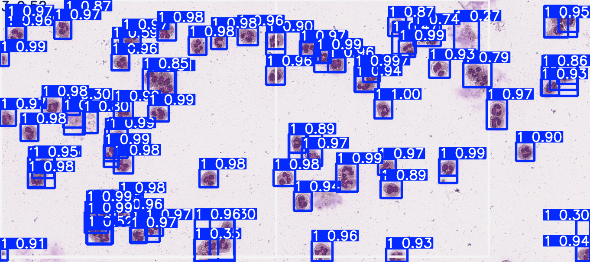

# NuclearLobeDetection

## Outputs

### Inference

- Example image with bounding boxes drawn around the detected nuclear lobes. Showing the classification and confidence score of each detection.

### Genetic Algorithm (Hypertuning of YOLO model)

#### Box Plot showing the distribution of fitness scores per generation

- Fitness is determined using metrics/**mAP50-95**(B) (mean average precision over 50-95% IoU (Intersection over Union) thresholds) and **mAP50** (mean average precision over 50% IoU threshold) for the validation set.
- This means that the fitness score is a value between 0 and 1, where 1 is the best possible score.

#### Line Graph showing the trend of the average fitness score per generation

## Technical Documentation

### YOLO

For each image in images/train or images/val, YOLO expects a corresponding .txt file with the same name in the labels/train or labels/val directory.

### Genetic Algorithm

Largely based on my UG Diss: https://github.com/danielmusselwhite/UG_Dissertation_Energy_Forecasting/blob/main/Src/Jupyter_Notebooks/4.%20LGBM%20forecasting%20Genetic%20Algorithm.ipynb

## Docs

